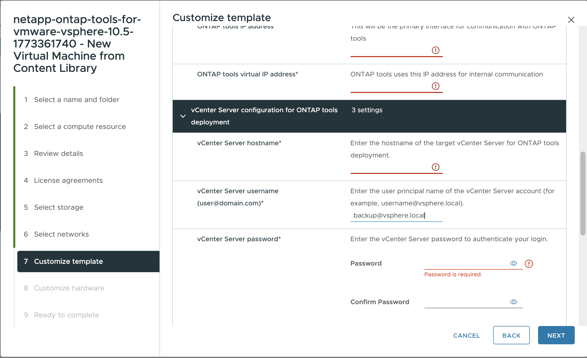
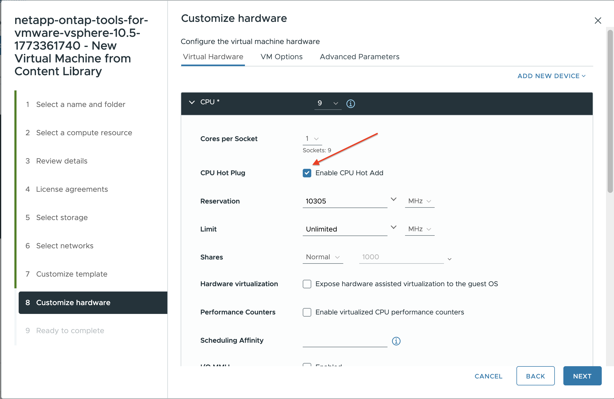

= ONTAP Toolsの導入
:allow-uri-read: 
:icons: font
:imagesdir: ../media/

[role="lead"]
ONTAP tools for VMware vSphereは、 NFS および VMFS データストアをサポートするコア サービスを備えた小規模の単一ノードとして展開されます。ONTAPの導入プロセスには最大45分かかる場合があります。

.作業を開始する前に
小さな単一ノードを展開する場合、コンテンツ ライブラリはオプションです。マルチノードまたは HA 展開の場合、コンテンツ ライブラリが必要です。 VMware では、コンテンツ ライブラリに VM テンプレート、vApp テンプレート、およびその他のファイルが保存されます。コンテンツ ライブラリを使用して展開すると、ネットワーク接続に依存しないため、シームレスなエクスペリエンスが実現します。

コンテンツ ライブラリを作成する前に、次の点を考慮してください。

* クラスター内のすべてのホストがアクセスできるように、共有データストアにコンテンツ ライブラリを作成します。
* ONTAP tools for VMware vSphereを導入する前に、コンテンツ ライブラリを設定します。
* アプライアンスを HA 用に構成する前に、コンテンツ ライブラリが作成されていることを確認してください。
+

NOTE: デプロイ後にコンテンツ ライブラリ内の OVA テンプレートを削除しないでください。

NOTE: 将来的に HA 展開を有効にするには、ONTAP tools 仮想マシンを ESXi ホスト上に直接展開しないでください。代わりに、ESXi ホスト クラスタまたはリソース プール内に展開してください。

コンテンツ ライブラリを作成するには、次の手順に従います。

. ONTAP tools for VMware vSphereのバイナリ（_.ova_）と署名付き証明書を含むファイルを次の場所からダウンロードします。  https://mysupport.netapp.com/site/products/all/details/otv10/downloads-tab["NetApp Support Site"^] 。
. vSphere Clientにログインします。
. vSphere Clientメニューを選択し、*[Content libraries]*を選択します。
. ページの右側にある*[作成]*を選択します。
. ライブラリの名前を指定し、コンテンツライブラリを作成します。
. 作成したコンテンツ ライブラリに移動します。
. ページ右側の*Actions*を選択し、*Import item*を選択して、OVAファイルをインポートします。

NOTE: 詳細については https://blogs.vmware.com/vsphere/2020/01/creating-and-using-content-library.html["コンテンツライブラリの作成と使用"]、ブログを参照してください。

NOTE: デプロイを進める前に、クラスタの分散リソース スケジューラ（DRS）を「保守的」に設定してください。これにより、インストール中に VM が移行されないことが保証されます。

ONTAP tools for VMware vSphere vSphereは、最初は非HA構成で展開されます。HA展開に拡張するには、CPUホット アドとメモリ ホットプラグを有効にする必要があります。この手順は、デプロイプロセスの一部として実行することも、デプロイ後にVMの設定を編集することもできます。

.手順
. ONTAP tools for VMware vSphereのバイナリ(_.ova_)と署名済み証明書が含まれているファイルをからダウンロードします https://mysupport.netapp.com/site/products/all/details/otv10/downloads-tab["NetApp Support Site"^]。OVA をコンテンツ ライブラリにインポートした場合は、この手順をスキップして次の手順に進むことができます
. vSphereサーバにログインします。
. OVA を展開するリソース プール、クラスター、またはホストに移動します。
+

NOTE: 自身が管理するvVolsデータストアにONTAP tools for VMware vSphere仮想マシンを絶対に保存しないでください。

. OVAは、コンテンツライブラリまたはローカルシステムから導入できます。
+
|===

| ローカルシステムカラ | コンテンツライブラリから 

| a.右クリックして*[Deploy OVF template...]*を選択します。b. URLからOVAファイルを選択するか場所を参照し、*[Next]*を選択します。 | A.コンテンツライブラリに移動し、導入するライブラリアイテムを選択します。B.* Actions *>* New VM from this template *を選択します。 
|===
. [名前とフォルダの選択]フィールドに仮想マシン名を入力し、その場所を選択します。
+
** vCenter Server 8.0.3 バージョンを使用している場合は、*この仮想マシンのハードウェアをカスタマイズする*オプションを選択します。これにより、*完了の準備ができました*ウィンドウに進む前に*ハードウェアのカスタマイズ*という追加の手順が有効になります。
** vCenter Server 7.0.3を使用している場合は、導入の最後にある*次の手順*セクションの手順に従ってください。image:../media/select-name.png["名前とフォルダを選択してください"]

. コンピュータリソースを選択し、* Next *を選択します。必要に応じて、[Automatically power on deployed VM]チェックボックスをオンにします。
. テンプレートの詳細を確認し、* Next *を選択します。
. ライセンス契約を読んで同意し、* Next *を選択します。
. 構成用のストレージとディスクフォーマットを選択し、*[次へ]*を選択します。
. 各ソースネットワークのデスティネーションネットワークを選択し、*[Next]*を選択します。
. *テンプレートのカスタマイズ*ウィンドウで、必要な項目を入力してください。
+

NOTE: vCenter ホスト名は、 ONTAPツール アプライアンスがデプロイされている vCenter Server インスタンスの名前です。

+
2 つの vCenter Server トポロジ（アプライアンスが 1 つの vCenter インスタンスでホストされ、別のインスタンスを管理する）でONTAPツールを展開する場合は、 ONTAPツールをホストする vCenter インスタンスに制限付きロールを割り当てることができます。OVF テンプレートのデプロイに必要な権限のみを持つ専用の vCenter ユーザーとロールを作成できます。詳細については、 https://review.docs.netapp.com/us-en/ontap-tools-vmware-vsphere-10_otv105-releasebranch/concepts/rbac-vcenter-use.html#vsphere-object-hierarchy["ONTAP Tools for VMware vSphere 10に含まれるロール"]。

+
ONTAPツールによって管理される vCenter インスタンスの場合、vCenter ユーザー アカウントに管理者権限があることを確認します。

+
** ホスト名には、アルファベット（A ~ Z、a ~ z）、数字（0 ~ 9）、およびハイフン（-）を使用する必要があります。デュアルスタックを設定するには、IPv6アドレスにマッピングされたホスト名を指定します。
+

NOTE: Pure IPv6はサポートされていません。mixedモードは、IPv6アドレスとIPv4アドレスの両方を含むVLANでサポートされます。

** ONTAP toolsのIPアドレスは、ONTAP toolsと通信するためのプライマリインターフェイスです。
** IPv4はノード設定のIPアドレスコンポーネントで、デバッグやメンテナンスの目的でノードの診断シェルやSSHアクセスを有効にするために使用できます。

. vCenter Server 8.0.3 バージョンを使用する場合は、*ハードウェアのカスタマイズ* ウィンドウで *CPU ホット アド* および *メモリ ホットプラグ* オプションを有効にして、HA 機能を使用できるようにします。 image:../media/customize-hw105-p2.png["メモリー ホットプラグ"]
. [選択内容の確認]ウィンドウで詳細を確認し、*[終了]*を選択します。
+
導入タスクが作成されると、進行状況がvSphereタスクバーに表示されます。

. VMの電源を自動的にオンにするオプションが選択されていない場合は、タスクの完了後にVMの電源をオンにします。

インストールの進行状況は、VMのWebコンソールで追跡できます。

OVF フォームに不一致がある場合は、ダイアログ ボックスが表示され、修正アクションが促されます。タブボタンを使用して移動し、必要な変更を加えて、[OK] を選択します。問題を解決するには 3 回試みることができます。  3 回試行しても問題が解決しない場合は、インストール プロセスが停止し、新しい仮想マシンでインストールを再試行することをお勧めします。

.次の手順
ONTAP tools for VMware vSphere を vCenter Server 7.0.3 とともに導入済みの場合は、導入後に以下の手順に従ってください。

. vCenter Clientにログインする
. ONTAP toolsノードの電源をオフにします。
. *インベントリ* の下にあるONTAP tools for VMware vSphereに移動し、*設定の編集* オプションを選択します。
. [CPU]オプションで、[CPUホットアドを有効にする]チェックボックスをオンにします。
. [Memory（メモリ）]オプションで、[Memory hot plug（メモリホットプラグ）]の[Enable（有効化）]チェックボックスをオンにします。

