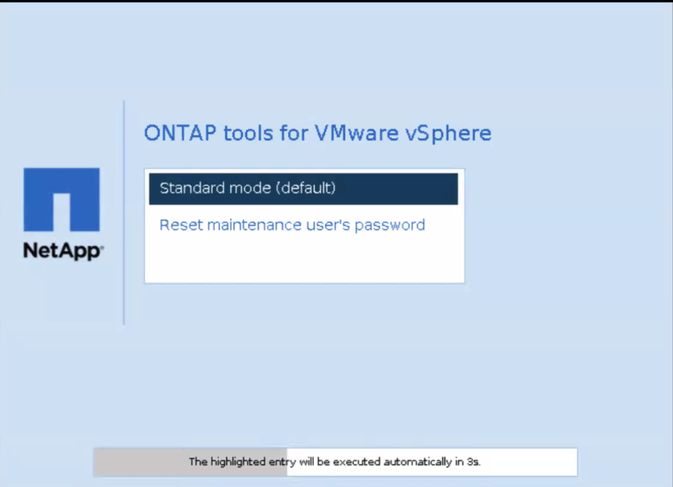

= ONTAP toolsのメンテナンスコンソールのパスワードをリセットする
:allow-uri-read: 
:icons: font
:imagesdir: ../media/

[role="lead"]
ゲスト OS の再起動操作中に、GRUB メニューにメンテナンス コンソールのユーザー パスワードをリセットするオプションが表示されます。このオプションを使用して、VM 上のメンテナンス コンソールのユーザー パスワードを更新します。パスワードをリセットすると、VM が再起動して新しいパスワードが設定されます。展開シナリオでは、VMの再起動後、他の2つのVMのパスワードも自動的に更新されます。

NOTE: ONTAP tools for VMware vSphereの場合、 ONTAPツール管理ノード (node1) のメンテナンス コンソール ユーザー パスワードを変更する必要があります。

.手順
. vCenter Serverにログインする
. VMを右クリックし、* Power *>* Restart Guest OS *を選択します。
システムの再起動中に、次の画面が表示されます。

+
5秒でオプションを選択できます。いずれかのキーを押して進行状況を停止し、GRUBメニューをフリーズします。

. [メンテナンスユーザのパスワードをリセット]*オプションを選択します。メンテナンスコンソールが開きます。
. コンソールで新しいパスワードを入力して確認します。 3回試すことができます。新しいパスワードを正常に入力すると、システムが再起動します。
. 続行するには*Enter*を押してください。システムは VM 上のパスワードを更新します。

NOTE: VM の電源投入時にも同じ GRUB メニューが表示されます。ただし、パスワードのリセット オプションは、*ゲスト OS の再起動* オプションとのみ併用する必要があります。
